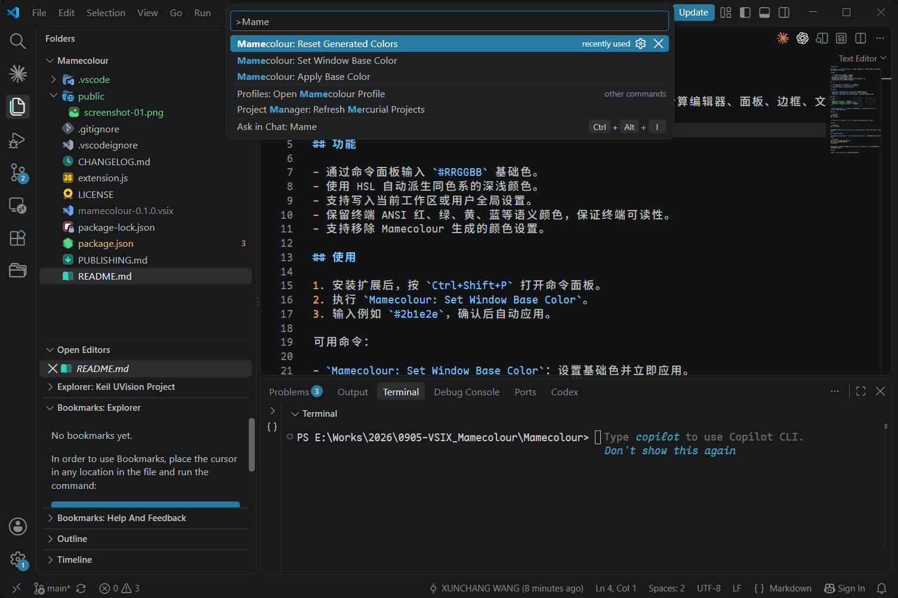
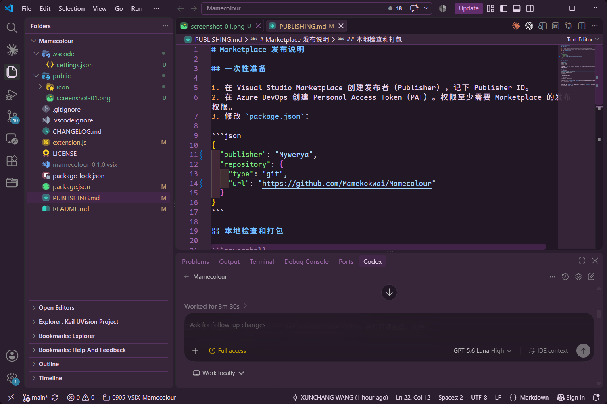
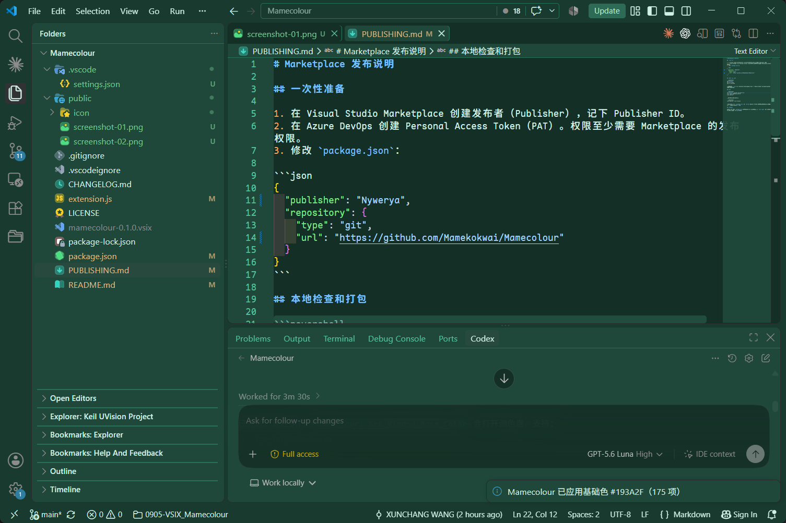

# Mamecolour

Mamecolour 是一个 VS Code 扩展：使用一个窗口基础色，自动计算编辑器、面板、边框、文字、选中态和终端等工作台颜色。

## 功能

- 通过命令面板输入 `#RRGGBB` 基础色。
- 使用 HSL 自动派生同色系的深浅颜色。
- 支持写入当前工作区或用户全局设置。
- 保留终端 ANSI 红、绿、黄、蓝等语义颜色，保证终端可读性。
- 支持移除 Mamecolour 生成的颜色设置。

## 使用

1. 安装扩展后，按 `Ctrl+Shift+P` 打开命令面板。
2. 执行 `Mamecolour: Set Window Base Color`。
3. 在调色盘中拖动色相条和颜色区域，或输入 `#1F1F1F`，点击“应用”。

可用命令：

- `Mamecolour: Set Window Base Color`：设置基础色并立即应用。
- `Mamecolour: Apply Base Color`：重新应用当前配置的基础色。
- `Mamecolour: Reset Generated Colors`：移除当前主题下由扩展生成的颜色。

## 配置

```json
{
  "mamecolour.baseColor": "#1F1F1F",
  "mamecolour.themeName": "",
  "mamecolour.configurationTarget": "workspace"
}
```

`themeName` 留空时，生成的颜色会应用到所有 VS Code 主题；填写主题名称后，才会限制在该主题范围内。

`configurationTarget` 为 `workspace` 时写入项目的 `.vscode/settings.json`，为 `global` 时写入用户设置。

## 界面预览

### 命令面板



### 发布配置



### 应用颜色后的效果



## 联系方式

问题反馈：<Nywerya@gmail.com>

## 本地开发

```powershell
npm install
npm run check
```

在 VS Code 中打开本目录，按 `F5` 启动 Extension Development Host 测试。

## 打包

```powershell
npm run package
```

命令会生成 `mamecolour-0.1.0.vsix`。在 VS Code 的扩展视图中选择“从 VSIX 安装...”即可安装。

## 发布到 Marketplace

发布前请修改 `package.json` 中的 `publisher`、`repository` 和版本号。然后安装发布工具并登录：

```powershell
npm install --global @vscode/vsce
vsce login YOUR_PUBLISHER_ID
vsce publish
```

Marketplace 发布需要发布者账号和 Personal Access Token。详细流程见 [PUBLISHING.md](PUBLISHING.md)。

## 许可

本项目使用 MIT License，见 [LICENSE](LICENSE)。
